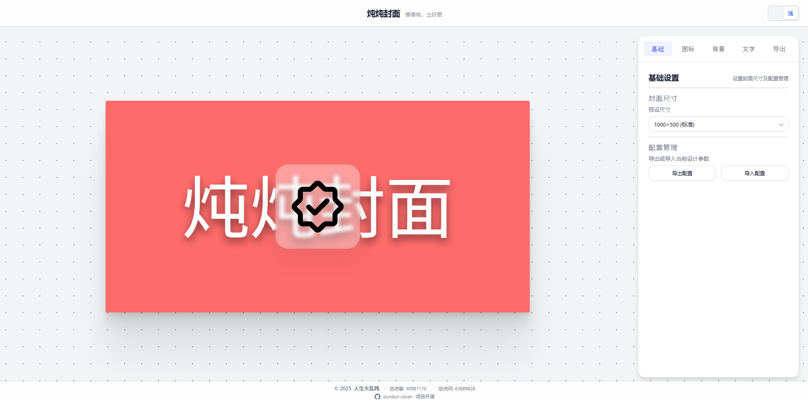

<div align="center">

# 炖炖封面

**dundun-cover**

轻量级博客封面生成器 | 原生 JavaScript | 完全免费 | 开箱即用

[](https://vitejs.dev/)
[](https://developer.mozilla.org/en-US/docs/Web/JavaScript)
[](https://workers.cloudflare.com/)
[](https://github.com/hjp5211314/dundun-cover)

[演示站点](https://ddfm.de5.net/) · [快速部署](#快速开始) · [功能介绍](#功能特性) · [常见问题](#常见问题)

</div>

---

> 慢慢炖，出好图

## 预览截图

<div align="center">



</div>

## 功能特性

| 功能 | 说明 |
|------|------|
| 多种尺寸 | 支持 1000×500、1200×600、1600×800 及自定义尺寸 |
| 丰富背景 | 纯色、渐变、弥散光感、点阵、波浪、噪点等 13 种背景 |
| 图标系统 | SVG 图标上传、图标库选择、多种特效 |
| 文字编辑 | 多字体支持、阴影效果、位置调节 |
| 多格式导出 | 支持 WebP、PNG、JPG 格式下载 |
| 图床上传 | 可选配置 Cloudflare R2 图床 |
| 深色模式 | 支持明暗主题切换 |
| 响应式 | 适配桌面端和移动端 |

## 技术栈

- **前端**: 原生 JavaScript (ES6+) + Canvas API
- **构建**: Vite 5.0
- **图床**: Cloudflare Workers + R2 (可选)

## 快速开始

```bash
# 克隆项目
git clone https://github.com/hjp5211314/dundun-cover.git
cd dundun-cover

# 安装依赖
npm install

# 启动开发服务
npm run dev

# 构建生产版本
npm run build
```

## 项目结构

```
dundun-cover/
├── index.html          # 主页面
├── css/                # 样式文件
├── js/                 # JavaScript 模块
│   ├── app.js          # 主应用入口
│   ├── background.js   # 背景渲染
│   ├── text-editor.js  # 文字编辑
│   ├── icon-effects.js # 图标特效
│   └── export.js       # 导出功能
├── img/                # 静态资源
└── vite.config.js      # Vite 配置
```

## 部署方式

### Vercel / Netlify / Cloudflare Pages

1. Fork 本仓库
2. 在 Vercel / Netlify / Cloudflare Pages 导入项目
3. 构建命令: `npm run build`
4. 输出目录: `dist`

### GitHub Pages

```bash
npm run build
# 将 dist/ 内容推送到 gh-pages 分支
```

### 自有服务器

```bash
npm run build
# 将 dist/ 文件夹上传到服务器
```

## 图床配置（可选）

如需启用图床上传功能，请参考 [CLOUDFLARE.md](./CLOUDFLARE.md) 配置 Cloudflare Workers + R2。

## 常见问题

**Q: 图片导出失败？**
A: 检查浏览器是否支持 Canvas API，建议使用 Chrome/Edge 最新版本。

**Q: 字体加载慢？**
A: 字体托管在第三方 CDN，首次加载可能较慢，后续会有缓存。

**Q: 如何自定义图标？**
A: 支持上传 SVG/PNG 图标，或使用内置图标库搜索。

## 贡献

欢迎提交 Issue 和 Pull Request！

## 作者

**人生大乱炖**

---

<div align="center">

### ⭐ 如果这个项目对你有帮助，请给个 Star！

</div>
